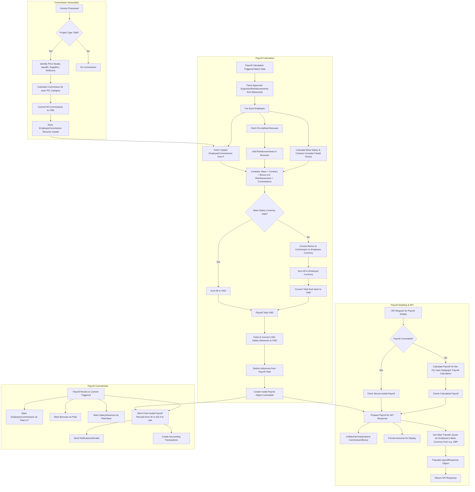

```mermaid
graph TD
    A[Invoice Processed] --> B{Project Type T&M?};
    B -- Yes --> C[Identify PICs Heads, Upsells, Suppliers, Referrers];
    B -- No --> X[No Commission];
    C --> D[Calculate Commission for each PIC Category];
    D --> E[Convert All Commissions to VND];
    E --> F[Store EmployeeCommission Records Unpaid];

    subgraph Commission Generation
        A
        B
        C
        D
        E
        F
        X
    end

    G[Payroll Calculation Triggered Batch Date] --> H[Fetch Approved Expenses/Reimbursements from Basecamp];
    H --> I[For Each Employee];
    I --> J[Calculate Base Salary & Contract Consider Partial Period];
    I --> K[Fetch Pre-defined Bonuses];
    K --> L[Add Reimbursements to Bonuses];
    I --> M[Fetch Unpaid EmployeeCommissions from F];
    N[Combine: Base + Contract + Bonus incl. Reimbursement + Commissions] --> O{Base Salary Currency VND?};
    O -- No --> P[Convert Bonus & Commission to Employee Currency];
    P --> Q[Sum All in Employee Currency];
    Q --> R[Convert Total Sum back to VND];
    R --> S[Payroll Total VND];
    O -- Yes --> T[Sum All in VND];
    T --> S;
    J --> N;
    L --> N;
    M --> N;
    S --> U[Fetch & Convert USD Salary Advances to VND];
    U --> V[Deduct Advances from Payroll Total];
    V --> W[Create model.Payroll Object Calculated];

    subgraph Payroll Calculation
        G
        H
        I
        J
        K
        L
        M
        N
        O
        P
        Q
        R
        S
        T
        U
        V
        W
    end

    Y[API Request for Payroll Details] --> Z{Payroll Committed?};
    Z -- Yes --> AA[Fetch Stored model.Payroll];
    Z -- No --> AB[Calculate Payroll On-the-Fly Uses Subgraph: Payroll Calculation];
    AB --> AC[Cache Calculated Payroll];
    AC --> AD;
    AA --> AD[Prepare Payroll for API Response];
    AD --> AE[UnMarshal Explanations Commission/Bonus];
    AD --> AF[Format Amounts for Display];
    AD --> AG[Get Wise Transfer Quote for Employee's Bank Currency from e.g. GBP];
    AG --> AH[Populate payrollResponse Object];
    AH --> AI[Return API Response];

    subgraph Payroll Detailing & API
        Y
        Z
        AA
        AB
        AC
        AD
        AE
        AF
        AG
        AH
        AI
    end

    AJ[Payroll Review & Commit Triggered] --> AK[Mark EmployeeCommissions as Paid in F];
    AJ --> AL[Mark Bonuses as Paid];
    AJ --> AM[Mark SalaryAdvances as Paid Back];
    AJ --> AN[Store Final model.Payroll Records from W or AD if re-calc];
    AN --> AO[Send Notifications/Emails];
    AN --> AP[Create Accounting Transactions];

    subgraph Payroll Commitment
        AJ
        AK
        AL
        AM
        AN
        AO
        AP
    end

    F --> M;
    W --> AD;
    W --> AN;
```
